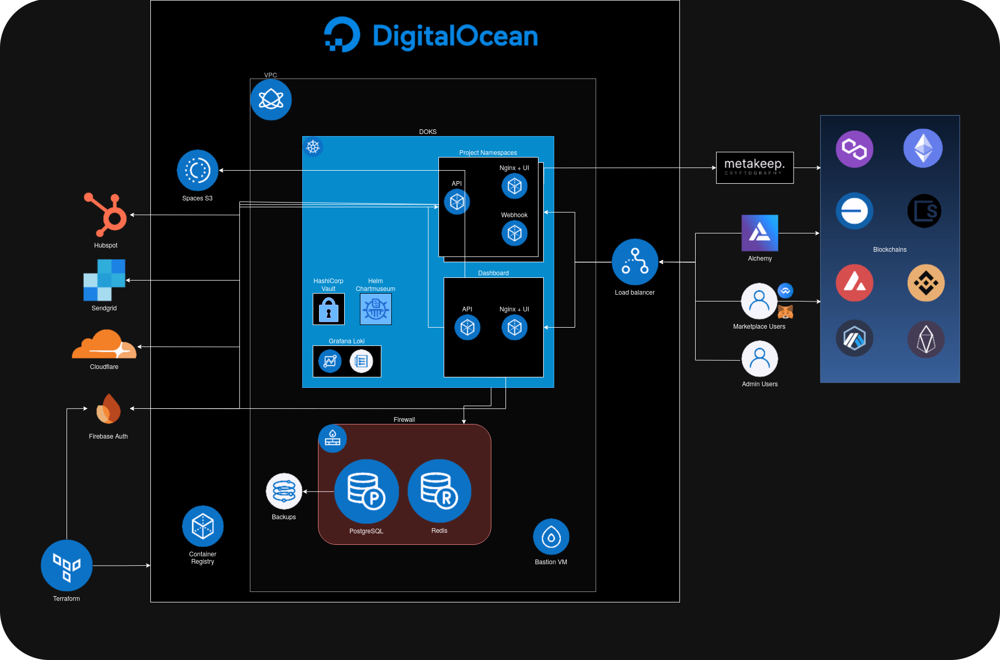

# Platform Architecture

## Diagram

***

<figure><figcaption></figcaption></figure>

## Overview

***

Our infrastructure is designed to deliver a highly secure, scalable, and efficient platform for Web3 applications, leveraging modern cloud technologies and best practices. We use DigitalOcean Kubernetes (DOKS) for container orchestration, integrated with various services and tools to ensure data protection, performance, and reliability. Our approach incorporates multiple layers of security, including virtual private clouds (VPCs), firewalls, and encryption, alongside real-time monitoring and incident response capabilities.

## Core Components

***

### Cloud Platform: DigitalOcean

* We deploy our infrastructure on DigitalOcean, utilizing their managed Kubernetes service (DOKS) to manage containerized applications. This setup allows us to efficiently scale our services while minimizing downtime and operational overhead.
* Key features include VPC for network isolation and Spaces S3 for storage, which enable us to keep sensitive data secure and maintain efficient data transfer.

### Container Orchestration: Kubernetes (DOKS)

* Kubernetes is at the core of our deployment strategy, with different project namespaces for isolating services like APIs, Nginx + UI, and Webhooks.
* Helm and HashiCorp Vault are used within the Kubernetes environment for secure configuration management and secrets storage, ensuring that sensitive information is encrypted and controlled at all times.
* Additional monitoring and logging capabilities are provided by tools like Grafana Loki for real-time observability.

## Security Measures

* **Network Security**
  * Our infrastructure is encapsulated within a VPC, which restricts network access to only essential services. We leverage multiple firewalls to further protect our services, controlling ingress and egress traffic according to security policies.
  * A load balancer sits at the edge of our network, distributing traffic efficiently while acting as a shield against potential DDoS attacks.
* **Data Security**
  * We use PostgreSQL and Redis databases for data storage, with regular backups to ensure data integrity and availability. All data at rest is encrypted, and communication between services is secured with TLS.
  * For user authentication, we integrate Firebase Auth to manage identities and secure access to the platform.
* **Cryptographic Services**
  * Our integration with MetaKeep provides advanced cryptographic services, ensuring secure key management and transaction signing. This adds an additional layer of security for Web3 interactions, especially for blockchain transactions.
  * We work with Alchemy for blockchain connectivity, ensuring reliable access to multiple blockchains, including Ethereum, Polygon, and others.

## DevOps and Automation

* **Infrastructure as Code (IaC) with Terraform**
  * We manage our infrastructure using Terraform, allowing for consistent and automated deployment of cloud resources. This ensures our environments are reproducible and makes scaling more efficient.
  * Our container registry is integrated with the CI/CD pipeline to streamline deployment and update processes.
* **Monitoring and Incident Response**
  * Real-time monitoring is implemented across the stack, using Grafana Loki for centralized logging. This helps us quickly detect and respond to any anomalies or security incidents.
  * Alerts and dashboards provide actionable insights for our engineering teams to maintain high availability and address potential issues proactively.

## User and API Access

* **Role-Based Access Control (RBAC)**
  * We implement RBAC policies to restrict access to different parts of the infrastructure based on user roles. This minimizes the risk of unauthorized access and ensures that only necessary permissions are granted.
  * Both marketplace users and admin users are separated in terms of access privileges to secure sensitive operations.
* **API Security**
  * All API endpoints are protected by authentication and authorization mechanisms to ensure that only valid requests are processed.
  * We utilize Nginx as a reverse proxy to add an additional layer of security by filtering incoming traffic before it reaches the core services.

## Conclusion

By leveraging a combination of Kubernetes, cloud-native tools, and modern security practices, we deliver a robust and secure infrastructure. Our multi-layered approach to security—from network and data protection to user access control—ensures that our platform remains reliable, scalable, and safe for all Web3 operations.

